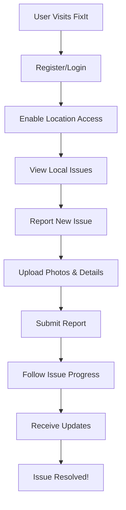

<div align="center">

# IssueX - Civic Issue Reporting Platform

[](https://reactjs.org/)
[](https://nodejs.org/)
[](https://mongodb.com/)
[](LICENSE)
[]()

> **A modern, community-driven platform for reporting and tracking civic issues in your local area**

[Live Demo](#) • [Documentation](#) • [Report Bug](#) • [Request Feature](#)

</div>

---

## Overview

FixIt is a comprehensive civic engagement platform that empowers communities to report, track, and resolve local issues. Whether it's infrastructure problems, environmental concerns, or public safety issues, FixIt provides the tools for citizens to make their voices heard and for local governments to respond effectively.

### Key Features

<table>
<tr>
<td width="50%">

#### Community-Driven Platform
- Report issues with photos and detailed descriptions
- Interactive map with real-time updates
- Follow issues and receive notifications
- Community engagement and sharing capabilities

</td>
<td width="50%">

#### Security & Privacy
- JWT-based authentication system
- Comprehensive data protection measures
- GDPR compliance ready
- Rate limiting and abuse protection

</td>
</tr>
<tr>
<td>

#### Modern User Experience
- Responsive design for all devices
- Smooth animations and transitions
- Accessibility-first approach
- Offline support capabilities

</td>
<td>

#### Location-Based Services
- GPS-powered issue reporting
- Radius-based issue discovery
- Interactive map visualization
- Local area filtering

</td>
</tr>
</table>

---

## Quick Start

### Prerequisites

- **Node.js** (v16 or higher)
- **MongoDB** (v4.4 or higher)
- **npm** or **yarn**

### Installation

```bash
# 1. Clone the repository
git clone https://github.com/yourusername/fixit.git
cd fixit

# 2. Install frontend dependencies
cd client
npm install

# 3. Install backend dependencies
cd ../server
npm install

# 4. Set up environment variables
cp env.example .env
# Edit .env with your configuration

# 5. Start MongoDB (if not running)
mongod

# 6. Start the backend server
npm run dev

# 7. Start the frontend (in a new terminal)
cd ../client
npm run dev
```

### Access the Application

Visit **http://localhost:3001** to start using FixIt.

---

## Technology Stack

<div align="center">

### Frontend


### Backend


### Security & Tools


</div>

---

## Project Structure

```
fixit/
├── client/                    # Frontend React application
│   ├── src/
│   │   ├── components/        # Reusable UI components
│   │   ├── contexts/          # React context providers
│   │   ├── pages/             # Page components
│   │   ├── utils/             # Utility functions
│   │   ├── App.jsx            # Main application component
│   │   └── main.jsx           # Application entry point
│   ├── public/                # Static assets
│   └── package.json           # Frontend dependencies
├── server/                    # Backend Node.js application
│   ├── routes/                # API route handlers
│   ├── middleware/            # Express middleware
│   ├── models/                # MongoDB schemas
│   ├── utils/                 # Utility functions
│   ├── server.js              # Main server file
│   └── package.json           # Backend dependencies
└── README.md                  # Project documentation
```

---

## Design System

### Color Palette
<div align="center">

| Color | Hex | Usage |
|-------|-----|-------|
|  | `#3B82F6` | Main brand color |
|  | `#6B7280` | Supporting elements |
|  | `#10B981` | Positive actions |
|  | `#F59E0B` | Caution states |
|  | `#EF4444` | Error states |

</div>

### Typography
- **Font Family**: Inter - Clean, modern sans-serif
- **Weights**: 300, 400, 500, 600, 700

### Animations
- **Fade In**: Smooth opacity transitions
- **Slide Up**: Content entrance animations
- **Scale In**: Interactive element feedback
- **Bounce**: Attention-grabbing effects

---

## Configuration

### Environment Variables

Create a `.env` file in the `server` directory:

```env
# Server Configuration
PORT=5000
NODE_ENV=development

# Database Configuration
MONGODB_URI=mongodb://localhost:27017/fixit

# JWT Configuration
JWT_SECRET=your-super-secret-jwt-key-change-this-in-production
JWT_EXPIRES_IN=7d

# Rate Limiting
RATE_LIMIT_WINDOW=15
RATE_LIMIT_MAX=100
```

### API Endpoints

| Method | Endpoint | Description |
|--------|----------|-------------|
| `POST` | `/api/auth/register` | User registration |
| `POST` | `/api/auth/login` | User login |
| `GET` | `/api/issues` | Get all issues |
| `POST` | `/api/issues` | Create new issue |
| `GET` | `/api/issues/:id` | Get specific issue |
| `PUT` | `/api/issues/:id` | Update issue |
| `DELETE` | `/api/issues/:id` | Delete issue |

---

## User Journey

<div align="center">



</div>

### User Flow

1. **Onboarding**
   - Create account with email and password
   - Accept Terms & Conditions and Privacy Policy
   - Enable location access for local issue discovery
   - Complete guided onboarding flow

2. **Issue Reporting**
   - Navigate to "Report Issue" page
   - Select issue category (Roads, Lighting, etc.)
   - Provide detailed description and photos
   - Confirm location and submit report

3. **Issue Discovery**
   - View interactive map of local issues
   - Filter by category, status, and distance
   - Click on markers for detailed information
   - Follow issues for updates

4. **Community Engagement**
   - Follow issues of interest
   - Share issues with others
   - View issue timelines and updates
   - Flag inappropriate content

---

## Security Features

<div align="center">

| Feature | Description |
|---------|-------------|
| **JWT Authentication** | Secure token-based authentication |
| **Password Hashing** | bcrypt for secure password storage |
| **Rate Limiting** | Protection against abuse and spam |
| **Input Validation** | Robust form validation and sanitization |
| **CORS Protection** | Cross-origin resource sharing security |
| **Data Protection** | Comprehensive privacy policy |

</div>

---

## Deployment

### Local Development
```bash
# Backend
cd server
npm run dev

# Frontend (new terminal)
cd client
npm run dev
```

### Production Deployment

#### Option 1: Netlify (Frontend) + Render (Backend)

**Frontend Deployment (Netlify):**
1. Build the frontend:
   ```bash
   cd client
   npm run build
   ```
2. Deploy to Netlify either by:
   - Dragging the `dist` folder to Netlify
   - Connecting to GitHub for continuous deployment

**Backend Deployment (Render):**
1. Push the code to GitHub
2. Connect Render to your GitHub repository
3. Configure the service with:
   - Build Command: `npm install`
   - Start Command: `npm start`
   - Root Directory: `server`

**Environment Variables:**
- Frontend (Netlify): `VITE_APP_API_URL` = your Render backend URL
- Backend (Render): Set all required environment variables (see server README)

#### Option 2: Custom Deployment
See [DEPLOYMENT.md](DEPLOYMENT.md) for detailed deployment instructions.

### Production Configuration
1. Set `NODE_ENV=production`
2. Use a production MongoDB instance (MongoDB Atlas recommended)
3. Configure proper CORS origins
4. Set secure JWT secrets
5. Enable HTTPS
6. Configure logging and monitoring

---

## Contributing

We welcome contributions to FixIt. We want to make contributing as easy and transparent as possible.

### How to Contribute

1. **Fork** the repository
2. **Create** a feature branch (`git checkout -b feature/AmazingFeature`)
3. **Commit** your changes (`git commit -m 'Add some AmazingFeature'`)
4. **Push** to the branch (`git push origin feature/AmazingFeature`)
5. **Open** a Pull Request

### Development Guidelines

- Write clean, readable code
- Add comments to complex logic
- Test your changes thoroughly
- Follow the existing code style
- Update documentation as needed

---

## License

This project is licensed under the **MIT License** - see the [LICENSE](LICENSE) file for details.

---

## Support

<div align="center">

### Need Help?

[Email Support](mailto:support@fixit.com) • [Documentation](#) • [Report Bug](#) • [Request Feature](#)

### Community

[Discord](#) • [Twitter](#) • [Facebook](#) • [Instagram](#)

</div>

---

<div align="center">

**Made with ❤️ by the FixIt Team**

*Making communities better, one issue at a time*

[Back to Top](#fixit---civic-issue-reporting-platform)

</div> 